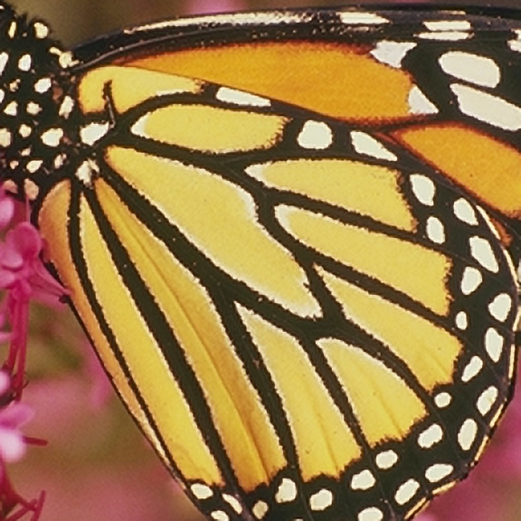

# SRCNN OpenCV GCC
This project was forked from https://github.com/shuwang127/SRCNN_Cpp, An Open source project of **"C++ Implementation of Super-Resolution resizing with Convolutional Neural Network"**.
And this project includes non-OpenCV library name called as ...

## latest update
* OpenCV4 compatibility updated.
* Supporting macOS universal binary.

## non-openCV model, libsrcnn
* **libsrcnn** is a stand-alone library that no dependancy with OpenCV.
* it is about 4 times more faster than OpenCV model, and currently it was moved to [libsrcnn](https://github.com/rageworx/libsrcnn) repository.
* ~Notice: this project contains old version of libsrcnn.~ removed.

### Bug Notice
 Original source SRCNN has bug at final merge process, and this source code also got same bug, too. Recommend to use my another library based on this project,  [libsrcnn](https://github.com/rageworx/libsrcnn).

### Discontinued Notice 
 This project is currently discontinued, please check new [libsrcnn](https://github.com/rageworx/libsrcnn) repository for more faster, and no need to link to OpenCV.

### Introduction
This is an open source project from original of this:
**SRCNN_Cpp** is a C++ Implementation of Image Super-Resolution using SRCNN which is proposed by Chao Dong in 2014.
 - If you want to find the details of SRCNN algorithm, please read the paper:  

   Chao Dong, Chen Change Loy, Kaiming He, Xiaoou Tang. Learning a Deep Convolutional Network for Image Super-Resolution, in Proceedings of European Conference on Computer Vision (ECCV), 2014
 - If you want to download the training code(caffe) or test code(Matlab) for SRCNN, please open your browse and visit http://mmlab.ie.cuhk.edu.hk/projects/SRCNN.html for more details.
 - And thank you very much for Chao's work in SRCNN.

### What changed ?
1. Code modified many things from original SRCNN.
1. OpenMP parallel processing, improved performance.
1. Supports almost of platform - POSIX compatibled.
    - MSYS2 and MinGW-W64
    - GCC of Linux
    - LLVM or CLANG of macOS, suporting universal binary build.

### License
Follows original SRCNN_Cpp, and it is released under the GPL v2 License (refer to the LICENSE file for details).

### Example
- Origin:

      

- Bicubic interplation x1.5

    

- SRCNN x1.5

      

### Requirements
1. Windows may need [MSYS2](https://www.msys2.org/) and [MinGW-W64](https://github.com/msys2/msys2/wiki/MSYS2-installation).
1. You need to install latest version of *OpenCV* to your build environments,
   install opencv libraries into your system with one of these:
    - MSYS2: ```pacman -S /mingw-w64-x86_64-opencv```
    - Debian: ```sudo apt-get install libopencv-dev```
    - MacOS
        1. Before install Brew : 
        ```
        sudo xcode-select --install 
        sudo xcodebuild -license
        ruby -e "$(curl -fsSL https://raw.githubusercontent.com/Homebrew/install/master/install)"
        ```
        1. After installed Brew :
        ```
        brew update
        brew install opencv4
        ```
1. Manual staic build OpenCV ( if needed )
    - Clone or download OpenCV source to you base level directory of this sources.
    - Go to opencv, then make a 'build' directory.
    - Type like this ( in case of MSYS2 Makefile )
      ```
      cmake -G "MSYS Makefiles" -DBUILD_SHARED_LIBS=OFF -DENABLE_PRECOMPILED_HEADERS=OFF -DWITH_IPP=OFF -DWITH_TBB=OFF -DWITH_FFMPEG=OFF -DWITH_MSMF=OFF -DWITH_VFW=OFF -DWITH_OPENMP=ON ..
      ```      
    - This project doesn't using video decoding, and there's too many erorrs occurs on Video processing source in OpenCV ( damn sucks cmake options, they're useless )


### Compile
You can compile the C/C++ files on the command line in your POSIX shell. 

``` Shell
make
```
If the compile is successful, you will see linked binary in 'bin' directory.

